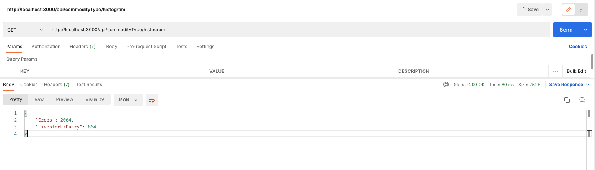
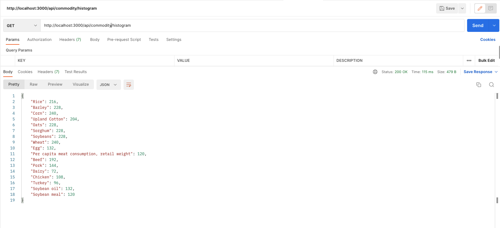
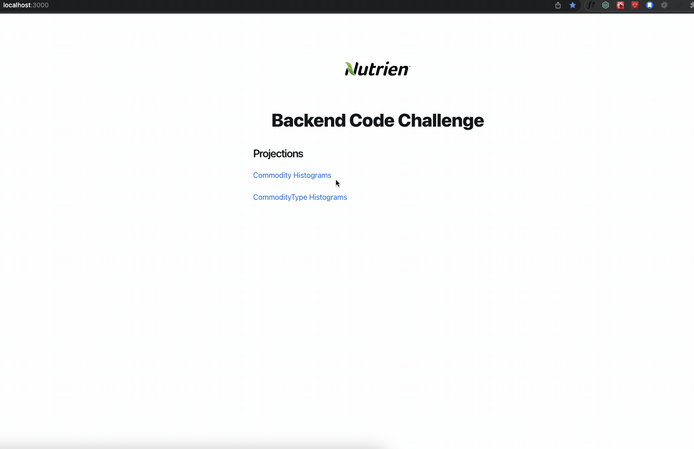
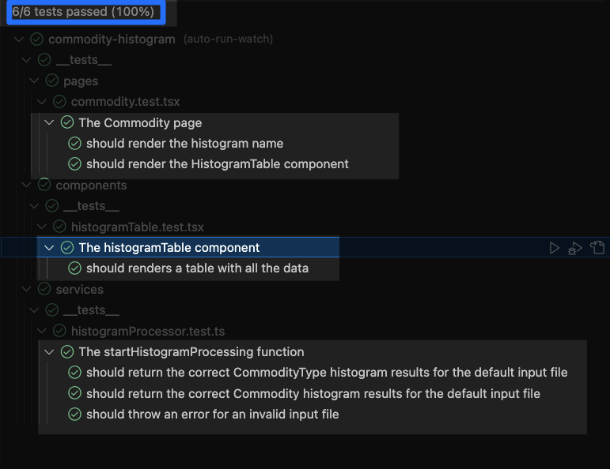

# Commodity Histogram

> [Check the webapp online here!](https://commodity-histogram.vercel.app)

**Commodity Histogram** is a simple Web Application that process CSV files containing agricultural data and compute its histogram.

## Demo

### CommodityType API endpoint



### Commodity API endpoint



### End to End



### Unit test



## Features/Technical highlights

-   Hosting : Vercel
-   Javascript Framework: ReactJS and NextJS
-   Javascript version: ES6
-   Javascript libraries: Typescript, Jest

## Setup

Create `.env` file and add the next content to run the app locally

```
API_URL=http://localhost:3000
```

```bash
$ npm i
$ npm run dev 
```

## Testing

```bash
$ npm i
$ npm run test 
```